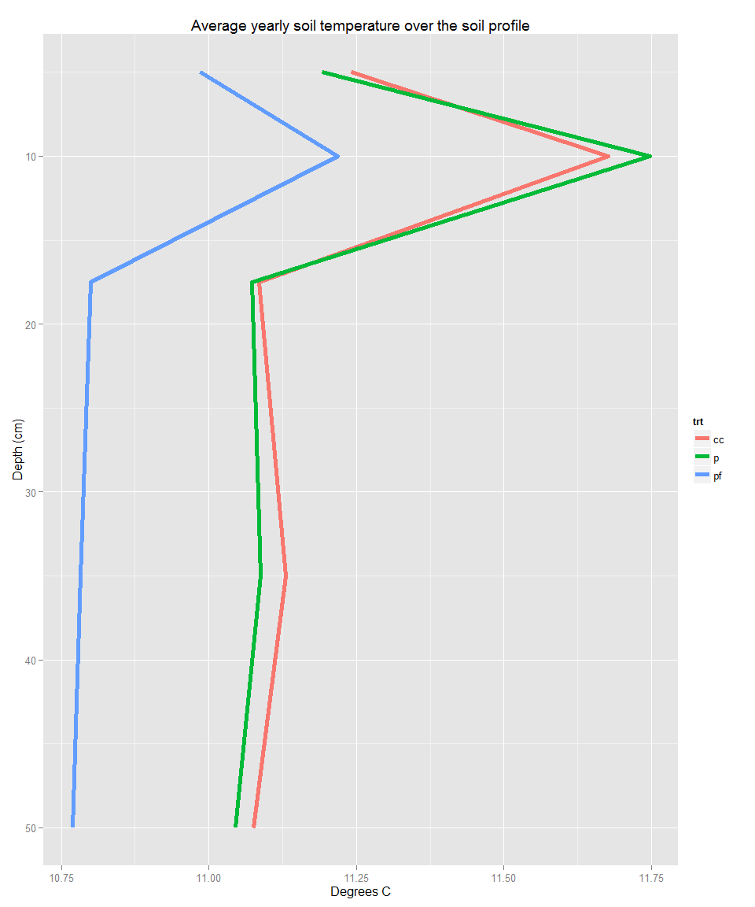

# Development of the soil organic carbon profile in prairie soils
Ranae Dietzel  
August 31, 2015  

## Introduction
In 1935, Weaver and colleagues first observed that while the upper 15 cm of a tallgrass prairie soil profile contained seventy percent of the profile’s root and rhizome biomass, it only contained forty percent of the profile’s soil carbon (C).  Roughly 100 years after continued cultivation of the prairie soils in the Midwestern US, this distribution of SOC persists (CITE).  Much of the loss of SOC near the soil surface and the retention of SOC at depth can be attributed to a gradient of soil temperature and moisture that creates more favorable conditions for decomposition near the soil surface.  However, these factors are not always able to account for differences in C input vs. C retention (CITE).  In this paper, we study the development of a restored prairie root C pool and a maize root C pool to examine how root inputs, depth, and the interaction of the two contribute to the vertical distribution of SOC.  

##Soil environment
Here is the proportion of soil C (brown line) and root C (green line) found over the soil profile.

 

Here are average temperatures and moistures over the profile. Soil moisture in the winter is removed from analysis.
 

 

